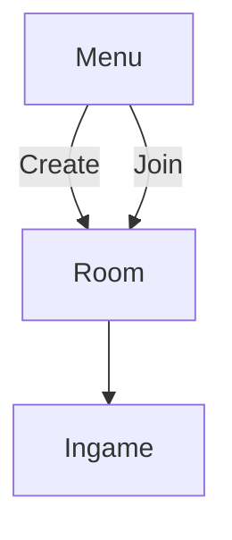
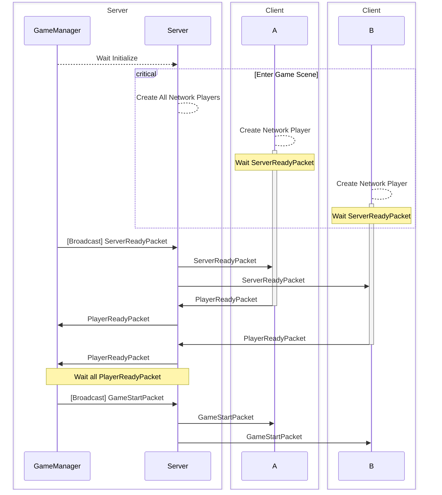

# TBL_Simulator

Unity Version: 2021.3.1f1

The Black List made with Unity

## Flow

### Scene Flow

```mermaid
flowchart

Menu[Menu]
Room[Room]
Ingame[Ingame]

Menu --> |Create|Room
Menu --> |Join|Room

Room --> Ingame

```

### Game Initialize

```mermaid
sequenceDiagram

box Server
participant M as GameManager
participant S as Server
end
box Client
participant P1 as A
end
box Client
participant P2 as B
end

M -->> S: Wait Initialize

critical Enter Game Scene
S --> S: Create All Network Players
P1 --> +P1: Create Network Player
Note over P1: Wait ServerReadyPacket
P2 --> +P2: Create Network Player
Note over P2: Wait ServerReadyPacket
end

M ->> S: [Broadcast] ServerReadyPacket
S ->> P1: ServerReadyPacket
S ->> P2: ServerReadyPacket

P1 ->> -S: PlayerReadyPacket
S ->> M: PlayerReadyPacket

P2 ->> -S: PlayerReadyPacket
S ->> M: PlayerReadyPacket

Note over S,M: Wait all PlayerReadyPacket

M ->> S: [Broadcast] GameStartPacket
S ->> P1: GameStartPacket
S ->> P2: GameStartPacket

```
